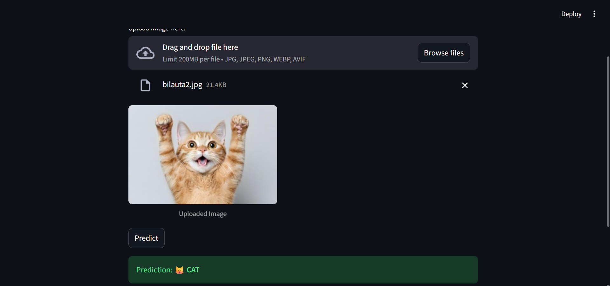
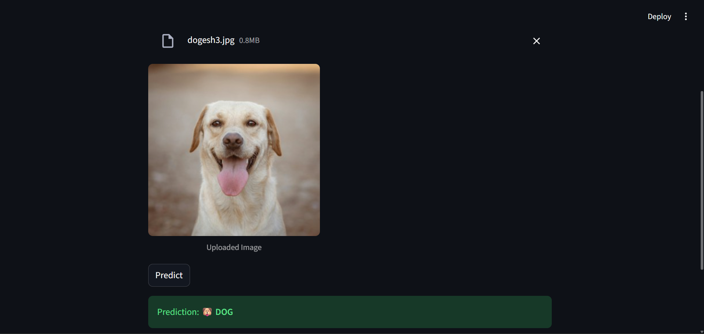

# 🐶🐱 Cat vs Dog Image Classifier (VGG16 + Transfer Learning)

This project is a **Deep Learning-based Cat vs Dog classifier** built using **TensorFlow** and **Transfer Learning with VGG16**.  
It takes an input image and predicts whether it contains a **Cat** or a **Dog**, along with a confidence score.

---

## 🚀 Features
- ✅ High Accuracy (~90%+) using **VGG16 Fine-Tuning**
- ✅ **Streamlit Web App** for easy image testing
- ✅ Supports **JPG, PNG, WEBP, AVIF**
- ✅ Clean and simple UI for prediction
- ✅ Model stored via **Git LFS** (safe for GitHub)

---

## 🧠 Model Overview
| Component | Description |
|----------|-------------|
| Base Model | VGG16 (pre-trained on ImageNet) |
| Trainable Layers | Block 5 + Custom Dense Layers |
| Loss Function | Binary Cross Entropy |
| Optimizer | Adam |
| Input Size | 150 × 150 |

---

## 📂 Project Structure

```
CAT-DOG-CLASSIFIER/
│ app.py                               # Streamlit UI Application
│ model.ipynb                          # Training Notebook
│ cat_dog_classifier_vgg16_finetuned.h5  # Saved Model (LFS)
│ requirements.txt                     # Project Dependencies
│ README.md                            # Project Documentation
```

---

## 🖼 Example Prediction Results

Replace the image below with your results:

> **Example Image 1**


> **Example Image 2**



---

## ▶️ Run Locally

### 1️⃣ Install Dependencies
```bash
pip install -r requirements.txt
```

### 2️⃣ Run the Streamlit App
```bash
streamlit run app.py
```

App will open in your browser at:
```
http://localhost:8501
```

---

## 🏗 How It Works (Pipeline)

1. Image is uploaded via Streamlit
2. It is resized to **150x150**
3. Preprocessed and normalized
4. Passed into Fine-Tuned VGG16 model
5. Output probability → Converted to Cat / Dog label

---

## 🔧 Requirements

```
streamlit>=1.31
tensorflow>=2.12
pillow>=9.0.0
pillow-avif-plugin
numpy>=1.23
```

---

## 🛠 Future Enhancements
- Deploy on **Hugging Face Spaces / Render / Railway**
- Convert to **TFLite** and make an **Android App**
- Extend to **Multi-class Pet Classifier**

---

## 📜 License
This project is released under the **MIT License**.

---

## 💬 Author
**Amit Sharma**  
⭐ GitHub: https://github.com/kramit624
